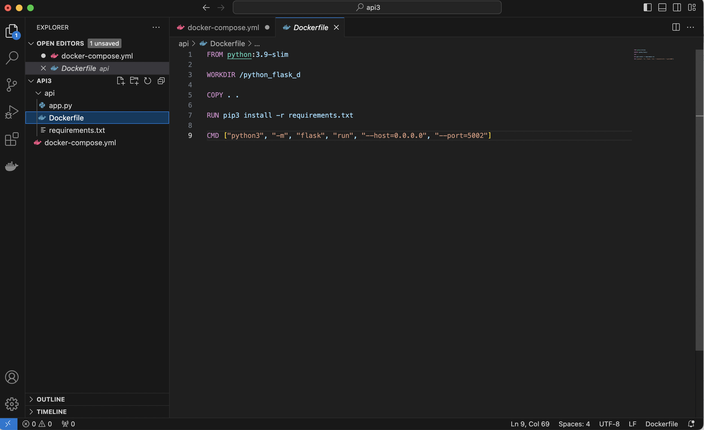
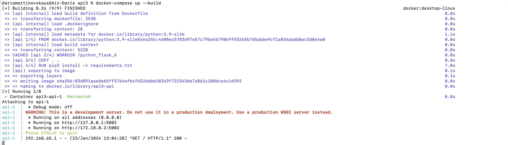
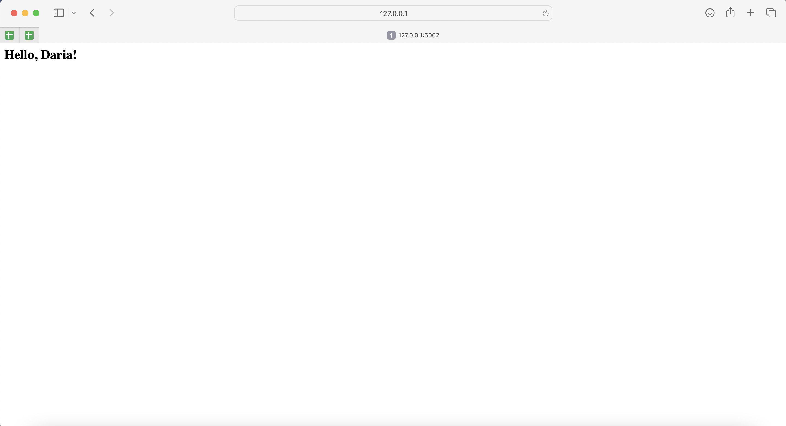

## Docker

#### 1. Download Docker for Mac from docker.com

#### 2. Check the Docker's version in terminal
```
dariamartinovskaya@Air-Daria api1 % docker --version
Docker version 24.0.7, build afdd53b
```
#### 3. Create the Project's folder

#### 4. Create api folder in the Project's folder

#### 5. Copy files required for the project 

List of working files copied:

app.py - python file which runs the browser main page.

requirements.txt - list of libraries required to run the python project. 

#### 6. Create docker-compose.yml file in the Project's folder
Docker-compose.yml file includes instructions for docker images building:
```
version: '3'

services:
  api:
    build: ./api

    ports:
      - "5002:5002"
```

Can be written in any text editor, for example, Visual Studio Code:
<div style="display:flex;">

</div>

#### 7. Create Dockerfile

Required for docker-compose to build the project.

```
FROM python:3.9-slim => downloading python 3.9 slim from docker storage

WORKDIR /python_flask_d => creating working directory for the project

COPY . . => libraries' requirements required to build the project are copied

RUN pip3 install -r requirements.txt => installing all requirements for the environment

CMD ["python3", "-m", "flask", "run", "--host=0.0.0.0", "--port=5002"] => running the script - building the project
```

<div style="display:flex;">

</div>

#### 8. Run a script (= build a project) in terminal
```
dariamartinovskaya@Air-Daria api1 % cd /Users/dariamartinovskaya/Downloads/api3 
dariamartinovskaya@Air-Daria api3 % docker-compose up --build
[+] Building 8.2s (9/9) FINISHED 
```
<div style="display:flex;">

</div>

#### 9. Run the project in browser
<div style="display:flex;">

</div>
