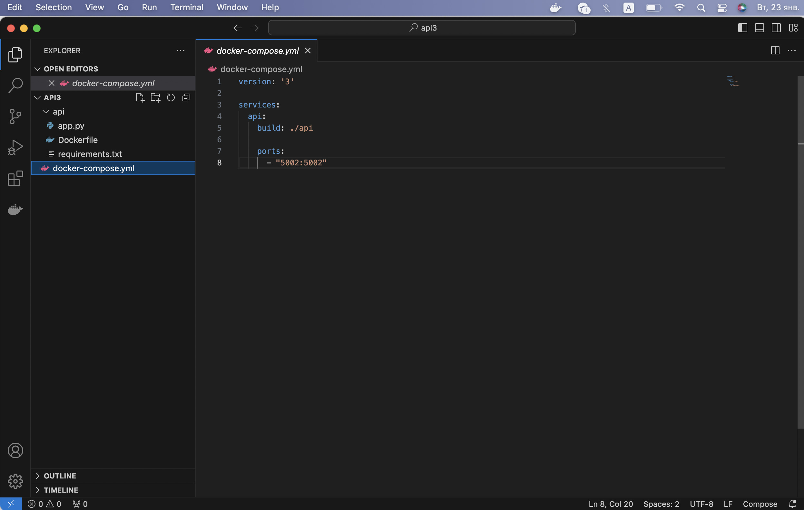

## Docker

#### 1. Download Docker for Mac from docker.com

#### 2. Check the Docker's version in terminal
```
dariamartinovskaya@Air-Daria api1 % docker --version
Docker version 24.0.7, build afdd53b
```
#### 3. Create the Project's folder

#### 4. Create "api" folder in the Project's folder

#### 5. Create docker-compose.yml file in the Project's folder
Docker-compose.yml file includes instructions for docker images building. Can be written in any text editor, for example, Visual Studio Code.
<div style="display:flex;">

</div>
