## Jenkins

#### 1. Open terminal and run the following command
```
dariamartinovskaya@MacBook-Air-Daria ~ %  docker run -p 8080:8080 -p 50000:50000 -d -v jenkins_home:/var/jenkins_home jenkins/jenkins:lts 
09657c0a327eff7a37857255d09297ace5696d534a3c535a019a6e64b13c4ec1
```
#### 2. Run the DOCKER PS command to list the process ID
```
dariamartinovskaya@MacBook-Air-Daria ~ % docker ps 
CONTAINER ID   IMAGE                 COMMAND                  CREATED          STATUS          PORTS                                              NAMES
09657c0a327e   jenkins/jenkins:lts   "/usr/bin/tini -- /u…"   36 seconds ago   Up 35 seconds   0.0.0.0:8080->8080/tcp, 0.0.0.0:50000->50000/tcp   suspicious_panini
```
#### 3. Fill in ip:port 127.0.0.1:8080 in the browser 
Here we see the started Jenkins page:
<div style="display:flex;">

</div>

#### 4. Run DOCKER LOGS 'CONTAINER ID' command in terminal to find a password required to unlock Jenkins 
```
dariamartinovskaya@MacBook-Air-Daria ~ % docker logs 09657c0a327e
Running from: /usr/share/jenkins/jenkins.war
webroot: /var/jenkins_home/war
2024-01-24 10:16:43.271+0000 [id=1]	INFO	winstone.Logger#logInternal: Beginning extraction from war file
2024-01-24 10:16:43.798+0000 [id=1]	WARNING	o.e.j.s.handler.ContextHandler#setContextPath: Empty contextPath
2024-01-24 10:16:43.828+0000 [id=1]	INFO	org.eclipse.jetty.server.Server#doStart: jetty-10.0.18; built: 2023-10-27T01:59:58.245Z; git: 8545fd9bf4cd0d0838f626b405fd4963441546b7; jvm 17.0.9+9
2024-01-24 10:16:43.953+0000 [id=1]	INFO	o.e.j.w.StandardDescriptorProcessor#visitServlet: NO JSP Support for /, did not find org.eclipse.jetty.jsp.JettyJspServlet
2024-01-24 10:16:43.976+0000 [id=1]	INFO	o.e.j.s.s.DefaultSessionIdManager#doStart: Session workerName=node0
2024-01-24 10:16:44.228+0000 [id=1]	INFO	hudson.WebAppMain#contextInitialized: Jenkins home directory: /var/jenkins_home found at: EnvVars.masterEnvVars.get("JENKINS_HOME")
2024-01-24 10:16:44.305+0000 [id=1]	INFO	o.e.j.s.handler.ContextHandler#doStart: Started w.@3e15bb06{Jenkins v2.426.2,/,file:///var/jenkins_home/war/,AVAILABLE}{/var/jenkins_home/war}
2024-01-24 10:16:44.313+0000 [id=1]	INFO	o.e.j.server.AbstractConnector#doStart: Started ServerConnector@6955cb39{HTTP/1.1, (http/1.1)}{0.0.0.0:8080}
2024-01-24 10:16:44.328+0000 [id=1]	INFO	org.eclipse.jetty.server.Server#doStart: Started Server@7c098bb3{STARTING}[10.0.18,sto=0] @1363ms
2024-01-24 10:16:44.330+0000 [id=28]	INFO	winstone.Logger#logInternal: Winstone Servlet Engine running: controlPort=disabled
2024-01-24 10:16:44.412+0000 [id=35]	INFO	jenkins.InitReactorRunner$1#onAttained: Started initialization
2024-01-24 10:16:44.420+0000 [id=48]	INFO	jenkins.InitReactorRunner$1#onAttained: Listed all plugins
2024-01-24 10:16:44.783+0000 [id=42]	INFO	jenkins.InitReactorRunner$1#onAttained: Prepared all plugins
2024-01-24 10:16:44.785+0000 [id=42]	INFO	jenkins.InitReactorRunner$1#onAttained: Started all plugins
2024-01-24 10:16:44.789+0000 [id=42]	INFO	jenkins.InitReactorRunner$1#onAttained: Augmented all extensions
2024-01-24 10:16:44.887+0000 [id=42]	INFO	jenkins.InitReactorRunner$1#onAttained: System config loaded
2024-01-24 10:16:44.887+0000 [id=42]	INFO	jenkins.InitReactorRunner$1#onAttained: System config adapted
2024-01-24 10:16:44.887+0000 [id=44]	INFO	jenkins.InitReactorRunner$1#onAttained: Loaded all jobs
2024-01-24 10:16:44.888+0000 [id=44]	INFO	jenkins.InitReactorRunner$1#onAttained: Configuration for all jobs updated
2024-01-24 10:16:44.908+0000 [id=61]	INFO	hudson.util.Retrier#start: Attempt #1 to do the action check updates server
2024-01-24 10:16:45.146+0000 [id=35]	INFO	jenkins.install.SetupWizard#init: 

*************************************************************
*************************************************************
*************************************************************

Jenkins initial setup is required. An admin user has been created and a password generated.
Please use the following password to proceed to installation:

d31771ccd46f409c9627590f28ffc028
This may also be found at: /var/jenkins_home/secrets/initialAdminPassword

*************************************************************
*************************************************************
*************************************************************

2024-01-24 10:16:52.398+0000 [id=35]	INFO	jenkins.InitReactorRunner$1#onAttained: Completed initialization
2024-01-24 10:16:52.406+0000 [id=26]	INFO	hudson.lifecycle.Lifecycle#onReady: Jenkins is fully up and running
2024-01-24 10:16:52.976+0000 [id=61]	INFO	h.m.DownloadService$Downloadable#load: Obtained the updated data file for hudson.tasks.Maven.MavenInstaller
2024-01-24 10:16:52.977+0000 [id=61]	INFO	hudson.util.Retrier#start: Performed the action check updates server successfully at the attempt #1
```
#### 5. Copy the administrator password, go to the browser, paste the password and click the [Continue] Button

#### 6. Install suggested plugins.
<div style="display:flex;">

</div>

#### 7. Fill in all fields to create an Admin User and click the [Save and Continue] Button
<div style="display:flex;">
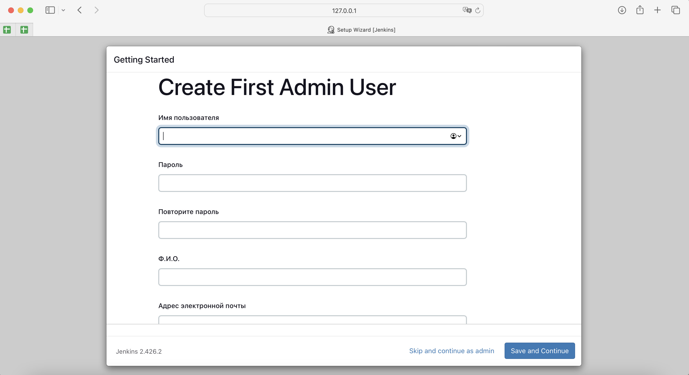
</div>

#### 8. Click the [Save and Finish] Button
<div style="display:flex;">
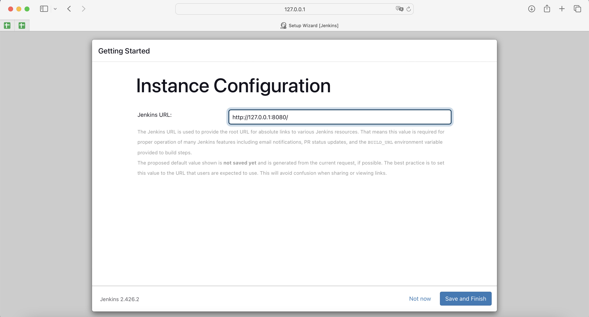
</div>

#### 9. Click the [Start using Jenkins] Button
<div style="display:flex;">
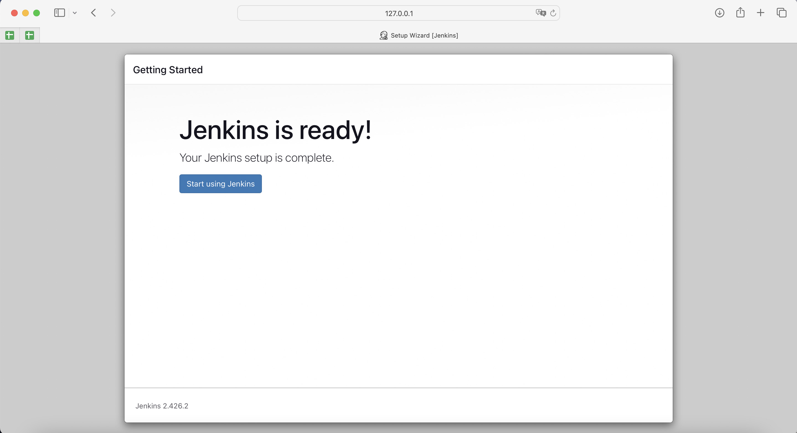
</div>

#### 10. Add .py file to the project's repository at gitHub
.py file should include the following code:
```
print("Hello, Jenkins!!!!!!")

def sum(x,y)
result = x+y
print(result)
return result
```

#### 11. Create item with "new1" item name at Jenkins, 
#### 12. Click the [Pipeline] Button 
#### 13. Click the [OK] Button
<div style="display:flex;">
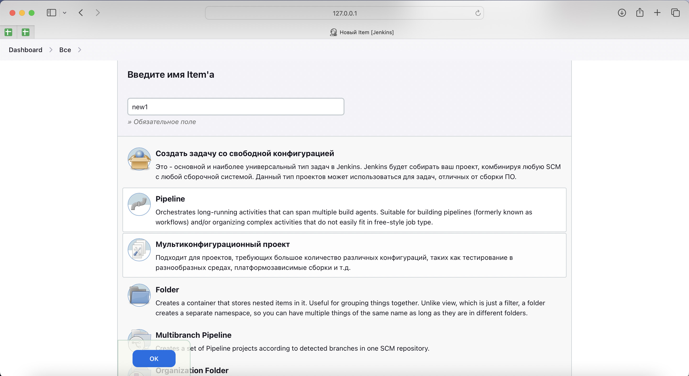
</div>

#### 14. Select "Hello World" template and click the "Pipeline Syntax" link to change the syntax
<div style="display:flex;">
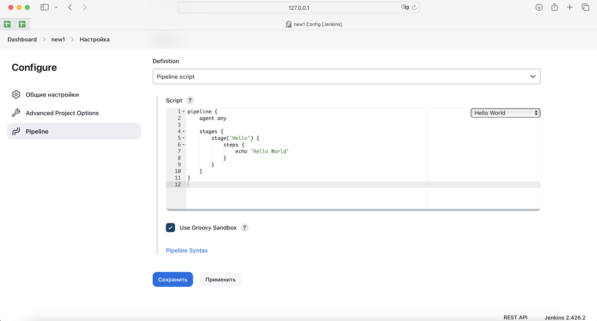
</div>

#### 15. Select "checkout: Check out from version control" from the "Sample Step" dropdown list to add checking git access
<div style="display:flex;">
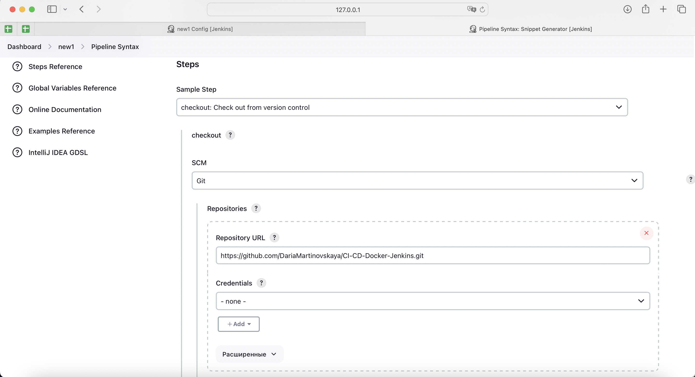
</div>

#### 16. Select "Git" from the "SCM" dropdown list
#### 17. Paste the URL copied from the gitHub project's repository to the "Repository URL" line to copy git repository to Jenkins
#### 18. Change Branch from "master" to "main"
#### 19. CLick the "Generate Pipeline Script" Button
<div style="display:flex;">
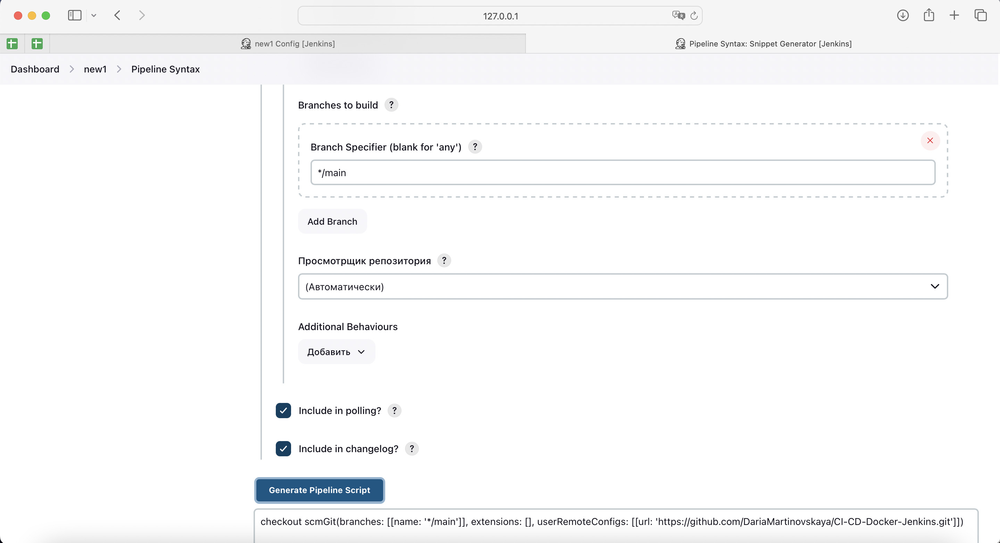
</div>

#### 20. Copy the script generated and paste it instead of 'echo "Hello World"' in the script
#### 21. Change stage name from 'Hello' to 'checkout'
#### 22. Click the [Apply] and the [Save] Buttons
<div style="display:flex;">
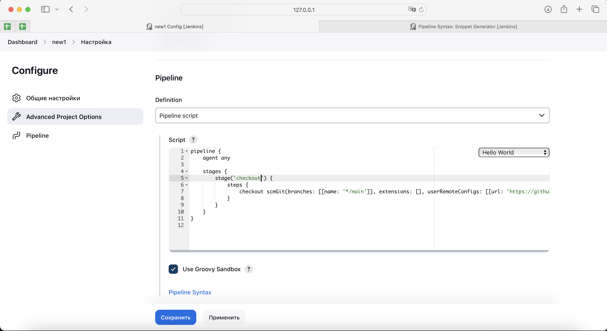
</div>

#### 23. Click the [Build now] Button
<div style="display:flex;">
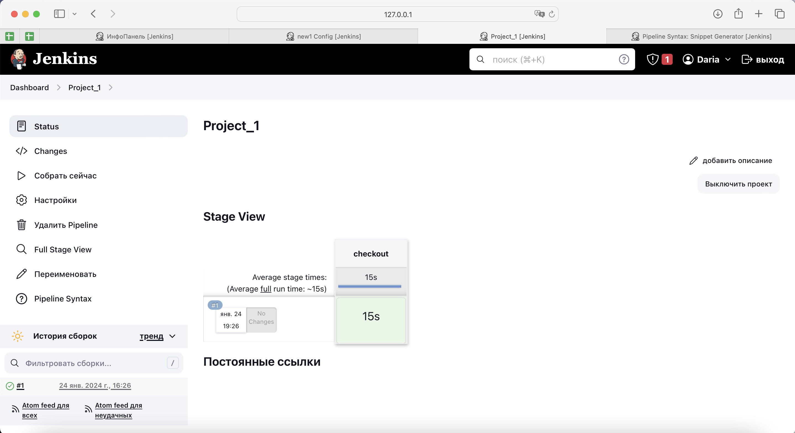
</div>

#### 24. Amend the pipeline script to run .sh as follows
```
stage('build') {
            steps {
               sh 'python3 new_1.py'
                }
```
=> Click the "Pipeline Syntax" link to change the syntax 
=> Select "sh: Shell script" from the "Sample Step" dropdown list 
=> Fill in "python3 new_1.py" into the "Shell Script" Line
=> CLick the "Generate Pipeline Script" Button
=> Copy the script generated and paste it into the script
=> Click the [Apply] and the [Save] Buttons

#### 25.Click the [Build now] Button
Error recieved as no python is installed in Docker container:
<div style="display:flex;">
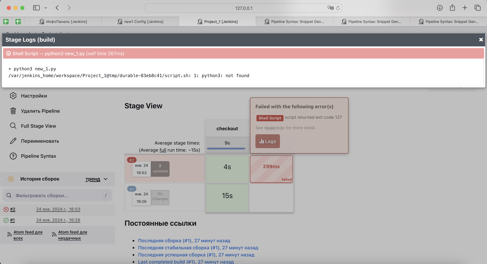
</div>

#### 26. Run the following commands in terminal to install python in the container
To open the container: 
```
docker exec -it -u 0 09657c0a327e /bin/bash
```
To update package manager:
```
apt-get update
```
To install python:
```
apt-get install python3
```
```
Y
```

#### 27.Click the [Build now] Button in Jenkins
Everything works.
<div style="display:flex;">
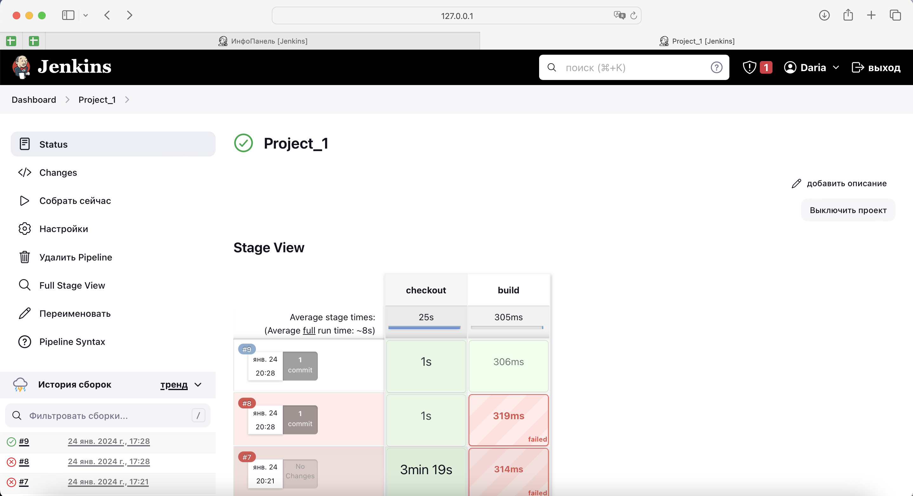
</div>
